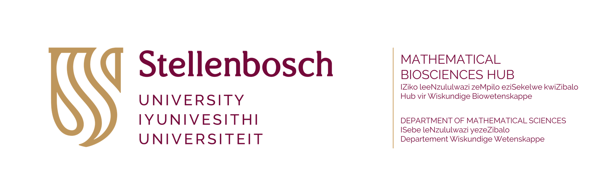
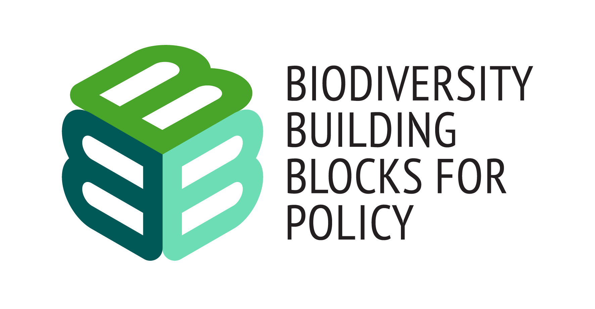

<picture>
 <source media="(prefers-color-scheme: light)" srcset="su_biomath_combined.png">
 
</picture><picture>
 <source media="(prefers-color-scheme: light)" srcset="B3_logo_full.png">
 
</picture>

# B3
SUN deliverables for EU Horizon B3 project: Biodiversity Building Blocks for Policy ([https://b-cubed.eu/](https://b-cubed.eu/))

## Introduction

B-Cubed is tackling the urgent challenge of understanding the global biodiversity crisis by offering fast, reliable, and consistent data that policy makers can use to make informed decisions. We bridge the gap between various data sources—ranging from citizen scientists and museums to research institutions—to create a more comprehensive view of biodiversity. Our approach uses data cubes and the Essential Biodiversity Variables framework to standardize this information, making it easier to monitor changes in biodiversity over time. SUN and other project teams work hand-in-hand with existing biodiversity programs to pinpoint policy needs and improve data integration. Our real-time, cloud-based models provide valuable insights into past, present, and future biodiversity trends. To encourage further research and application, we're developing automated workflows for data modeling and change indicators. B-Cubed's effectiveness is showcased in four diverse case studies, each varying in geographic scale, biodiversity richness, and data availability.

## Statement

B3 (Biodiversity Building Blocks for policy) receives funding from the European Union’s Horizon Europe Research and Innovation Programme (ID No 101059592). Views and opinions expressed are however those of the author(s) only and do not necessarily reflect those of the European Union or the European Commission. Neither the EU nor the EC can be held responsible for them.
